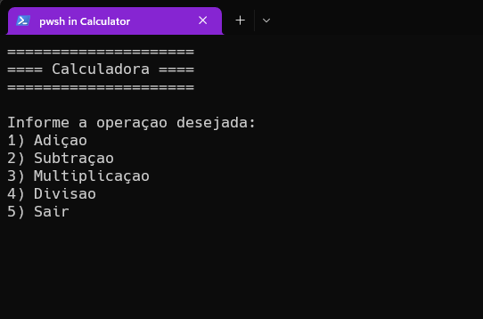
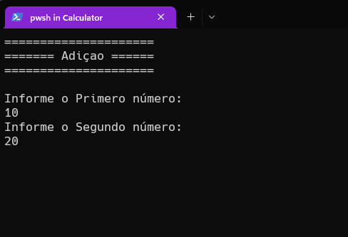
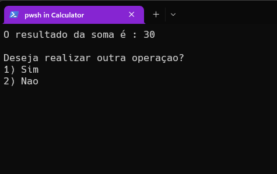

# calculadora-console-csharp

Calculadora modo console desenvolvida com C# e .NET 6

### Intruções para rodar o projeto:

Com o .NET SDK instalado na máquina execute o comando "dotnet run" dentro desse repositório.

### Pré-visualização

 
- Menu Principal

 
- Tela de operação

 
- Tela de resultado da operação

